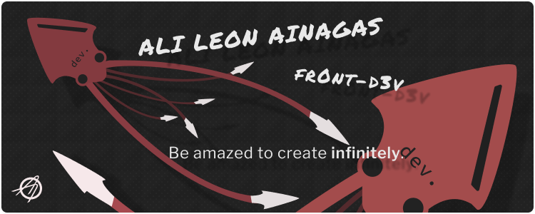

#



</br>

_Hey there!_ As you know, my name is Alí. The most relevant thing about me is that I love learning, not only about programming but everything in the world! I'm also a Front-End Web Dev, UI/UX prototype design rookie and a _(upcoming)_ digital artist.

</br>

<center><h3><strong>Languages and tools<strong><h3></center>

</br>

<center>
<svg xmlns="http://www.w3.org/2000/svg" width="33" height="33" viewBox="0 0 33 33" fill="none"><path d="M17.6 4.8L18.6 6.3 19.5 4.8V6.8H20.8V2.8H19.5L18.6 4.3 17.8 2.8H16.3V6.8H17.6V4.8ZM24.7 6.8V5.5H22.8V2.8H21.5V6.8H24.7ZM13.2 6.8H14.6V4.2H15.8V2.8H12V4.2H13.2V6.8ZM9 5.5H10.2V6.8H11.5V2.8H10.2V4.2H9V2.8H7.6V6.8H9V5.5ZM6.8 8.2L8.4 27.4 16.2 29.5 23.9 27.4 25.5 8.2H6.8ZM21.9 14.3H12.8L13.1 16.7H21.6L21 24 16.2 25.4 11.4 24 11 20.2H13.4L13.5 22.2 16.2 22.8 18.8 22.2 19.1 19.1H10.8L10.2 12H22.2L21.9 14.3V14.3Z" fill="#222"/></svg>
<svg xmlns="http://www.w3.org/2000/svg" width="32" height="32" viewBox="0 0 32 32" fill="none"><path d="M5.6 4.2H26.4L24.5 25.6 16 28 7.5 25.6 5.6 4.2ZM22.5 8.6L9.5 8.6 9.7 11.2 19.7 11.2 19.5 13.9H12.9L13.1 16.4H19.2L18.9 19.9 16 20.7 13.1 19.9 12.9 17.8H10.3L10.6 21.6 16 23.3 21.3 21.8 22.5 8.6V8.6Z" fill="#222"/></svg>
<svg xmlns="http://www.w3.org/2000/svg" width="32" height="32" viewBox="0 0 32 32" fill="none"><path d="M0 0H32V32H0V0ZM8.4 26.8C9.3 28.6 10.8 29.5 12.9 29.5 14.3 29.5 15.4 29.1 16.2 28.4 17 27.6 17.4 26.5 17.4 25V14.7H14.4V24.9C14.4 26.2 13.9 26.8 12.8 26.8 12.1 26.8 11.4 26.3 10.8 25.3L8.4 26.8ZM19 26.4C20.1 28.5 21.9 29.5 24.5 29.5 26 29.5 27.2 29.1 28.1 28.4 29 27.6 29.5 26.6 29.5 25.3 29.5 24.1 29.2 23.2 28.5 22.5 27.9 21.8 26.9 21.2 25.5 20.6L24.8 20.3C24.1 20 23.6 19.7 23.3 19.5 23.1 19.2 22.9 18.9 22.9 18.4 22.9 18.1 23 17.8 23.3 17.5 23.5 17.3 23.9 17.2 24.3 17.2 25.2 17.2 25.8 17.6 26.3 18.4L28.6 16.9C27.7 15.3 26.3 14.5 24.3 14.5 23 14.5 21.9 14.9 21.1 15.6 20.3 16.4 19.9 17.3 19.9 18.5 19.9 19.7 20.2 20.6 20.8 21.3 21.4 21.9 22.4 22.5 23.6 23L24.3 23.3C24.9 23.6 25.3 23.8 25.5 23.9 25.8 24 26 24.2 26.2 24.5 26.4 24.7 26.5 25 26.5 25.3 26.5 25.8 26.3 26.1 26 26.4 25.6 26.7 25.1 26.8 24.5 26.8 23.2 26.8 22.2 26.2 21.5 25L19 26.4Z" fill="#222"/></svg>
<svg xmlns="http://www.w3.org/2000/svg" width="32" height="32" viewBox="0 0 32 32" fill="none"><path d="M28.2 14.5C28.2 13.6 28.3 13.1 28.3 12.2 28.3 10.8 27.8 10.3 26.6 10.3H25.8V11.3H26C26.6 11.3 26.8 11.5 26.8 12.2 26.8 12.9 26.7 13.6 26.7 14.4 26.7 15.4 27 15.8 27.7 15.9V16C27 16.1 26.7 16.5 26.7 17.5 26.7 18.3 26.8 19 26.8 19.7 26.8 20.4 26.6 20.6 26 20.6V20.6H25.8V21.7H26.6C27.8 21.7 28.3 21.2 28.3 19.8 28.3 18.9 28.2 18.4 28.2 17.5 28.2 17.1 28.5 16.6 29.3 16.6V15.4C28.5 15.4 28.2 14.9 28.2 14.5V14.5ZM23.8 15.8C23.1 15.5 22.5 15.4 22.5 14.9 22.5 14.6 22.8 14.4 23.3 14.4 23.7 14.4 24.2 14.6 24.7 15L25.5 13.8C25 13.4 24.3 12.9 23.2 12.9 21.8 12.9 20.7 13.8 20.7 15 20.7 16.1 21.7 16.6 22.5 16.9 23.2 17.2 23.8 17.4 23.8 17.8 23.8 18.2 23.6 18.4 23 18.4 22.4 18.4 21.9 18.2 21.3 17.7L20.4 19C21.1 19.5 22.1 19.9 22.9 19.9 24.6 19.9 25.6 19 25.6 17.8 25.6 16.6 24.6 16.1 23.8 15.8ZM8.8 18.3C8.7 18.3 8.5 18.1 8.5 17.7V10.3H5.4C4.2 10.3 3.7 10.8 3.7 12.2 3.7 13.1 3.8 13.6 3.8 14.5 3.8 14.9 3.5 15.4 2.7 15.4V16.6C3.5 16.6 3.8 17.1 3.8 17.5 3.8 18.4 3.7 18.8 3.7 19.8 3.7 21.2 4.2 21.7 5.4 21.7H6.2V20.7H6C5.4 20.7 5.2 20.4 5.2 19.7 5.2 19 5.3 18.4 5.3 17.6 5.3 16.6 5 16.2 4.3 16V15.9C5 15.8 5.3 15.4 5.3 14.4 5.3 13.6 5.2 13 5.2 12.2 5.2 11.5 5.4 11.3 6 11.3H6.5V17.6C6.5 18.9 7 19.8 8.3 19.8 8.8 19.8 9.1 19.8 9.3 19.7L9.1 18.2C9 18.3 8.9 18.3 8.8 18.3V18.3ZM18.5 15.8C17.8 15.5 17.2 15.4 17.2 14.9 17.2 14.6 17.5 14.4 17.9 14.4 18.4 14.4 18.9 14.6 19.3 15L20.2 13.8C19.7 13.4 18.9 12.9 17.9 12.9 16.4 12.9 15.4 13.8 15.4 15 15.4 16.1 16.4 16.6 17.2 16.9 17.8 17.2 18.5 17.4 18.5 17.8 18.5 18.2 18.2 18.4 17.6 18.4 17.1 18.4 16.5 18.2 16 17.7L15.1 19C15.8 19.5 16.8 19.9 17.6 19.9 19.3 19.9 20.3 19 20.3 17.8 20.3 16.6 19.3 16.1 18.5 15.8V15.8ZM12 12.9C10.4 12.9 8.9 14.3 9 16.4 9 18.5 10.4 19.8 12.3 19.8 13 19.8 13.9 19.5 14.6 19.1L13.9 17.9C13.5 18.2 13 18.3 12.5 18.3 11.6 18.3 11 17.9 10.8 16.9H14.8C14.8 16.7 14.8 16.4 14.8 16.1 14.8 14.3 13.9 12.9 12 12.9V12.9ZM10.8 15.7C10.9 14.8 11.4 14.4 12.1 14.4 12.8 14.4 13.2 14.9 13.2 15.7H10.8Z" fill="#222"/></svg>
<svg xmlns="http://www.w3.org/2000/svg" width="33" height="33" viewBox="0 0 33 33" fill="none"><g clip-path="url(#clip0)"><path d="M15.8 22.9C15.8 22.9 15.8 23 15.8 22.9V22.9ZM28.3 18.6C27.3 18.6 26.3 18.8 25.4 19.2 25.1 18.6 24.8 18.1 24.8 17.7 24.7 17.3 24.6 17 24.7 16.5 24.8 15.9 25.1 15.2 25.1 15.1 25.1 15 25 14.8 24.4 14.8 23.7 14.8 23.2 14.9 23.1 15.1 23 15.4 22.9 15.7 22.8 16 22.7 16.6 21.5 18.7 20.9 19.8 20.7 19.4 20.5 19 20.4 18.7 20.4 18.2 20.3 18 20.4 17.4 20.4 16.9 20.8 16.1 20.8 16.1 20.8 16 20.7 15.7 20 15.7 19.4 15.7 18.8 15.8 18.8 16 18.7 16.2 18.6 16.6 18.5 17 18.4 17.4 16.8 20.8 16.4 21.7 16.2 22.2 16 22.6 15.9 22.8 15.9 22.9 15.9 22.9 15.8 22.9 15.9 22.9 15.9 22.9 15.9 22.9 15.8 23.1 15.7 23.2 15.7 23.2V23.2C15.6 23.4 15.5 23.5 15.5 23.5 15.4 23.5 15.4 23.1 15.5 22.5 15.7 21.3 16.3 19.4 16.3 19.4 16.3 19.3 16.4 19 15.9 18.8 15.5 18.7 15.3 18.9 15.2 18.9 15.2 18.9 15.2 19 15.2 19 15.2 19 15.7 16.9 14.2 16.9 13.3 16.9 12 17.9 11.4 18.8 11 19.1 10.1 19.5 9.2 20L8.2 20.6C8.2 20.6 8.1 20.5 8.1 20.5 6.3 18.6 3 17.2 3.2 14.7 3.2 13.7 3.5 11.3 9.5 8.3 14.4 5.9 18.3 6.5 19 8 20 10.2 16.9 14.1 11.8 14.7 9.9 14.9 8.9 14.1 8.6 13.9 8.4 13.6 8.3 13.6 8.2 13.6 8 13.7 8.2 14 8.2 14.1 8.4 14.5 9 15.2 10.1 15.6 11 15.9 13.3 16 16 15 19.1 13.8 21.5 10.5 20.8 7.7 20.1 4.9 15.4 3.9 11 5.5 8.3 6.5 5.5 7.9 3.5 9.8 1 12.1 0.6 14.1 0.8 14.9 1.4 17.9 5.4 19.8 7 21.2L6.8 21.3C6 21.7 2.9 23.4 2.1 25.1 1.3 27 2.3 28.4 2.9 28.6 5 29.2 7.2 28.1 8.3 26.4 9.5 24.7 9.3 22.5 8.8 21.4 8.8 21.4 8.8 21.4 8.8 21.4 9.4 21 10 20.7 10.6 20.4 10.4 20.9 10.3 21.6 10.2 22.5 10.1 23.6 10.5 25 11.1 25.6 11.4 25.8 11.7 25.8 11.9 25.8 12.6 25.8 12.9 25.3 13.2 24.6 13.7 23.7 14 22.8 14 22.8 14 22.8 13.6 25.4 14.9 25.4 15.3 25.4 15.8 24.8 16 24.5V24.5C16 24.5 16 24.5 16 24.4 16.1 24.3 16.1 24.3 16.1 24.3V24.3C16.3 24 16.7 23.2 17.4 22 18.2 20.4 18.9 18.4 18.9 18.4 19 18.8 19.1 19.3 19.2 19.7 19.4 20.2 19.7 20.7 19.9 21.2 19.7 21.5 19.6 21.6 19.6 21.6 19.6 21.6 19.6 21.6 19.6 21.6 19.5 21.8 19.3 22 19.1 22.2 18.5 23 17.7 23.9 17.6 24.1 17.5 24.4 17.5 24.6 17.8 24.8 17.9 24.9 18.2 25 18.5 24.9 19.1 24.9 19.5 24.8 19.7 24.7 20.1 24.5 20.4 24.4 20.7 24.1 21.4 23.7 21.7 23 21.7 22.1 21.7 21.7 21.5 21.2 21.3 20.7 21.4 20.7 21.5 20.6 21.5 20.5 22.2 19.5 22.7 18.5 23.3 17.5 23.3 17.9 23.4 18.3 23.6 18.7 23.7 19.2 23.9 19.6 24.1 20 23.2 20.8 22.6 21.7 22.4 22.2 22.1 23.3 22.4 23.8 22.9 23.9 23.1 23.9 23.5 23.8 23.8 23.7 24.1 23.6 24.5 23.4 24.8 23.2 25.5 22.7 26.1 22.1 26 21.2 26 20.8 25.9 20.4 25.8 20 26.5 19.7 27.6 19.5 28.9 19.7 31.6 20 32.2 21.7 32.1 22.4 32 23.2 31.4 23.6 31.2 23.7 31 23.8 30.9 23.9 31 23.9 31 24.1 31.1 24.1 31.2 24 31.5 24 32.7 23.5 32.8 22.1 32.8 20.4 31.2 18.5 28.3 18.6L28.3 18.6ZM6.8 25.8C5.9 26.8 4.6 27.2 4.1 26.9 3.5 26.5 3.7 25 4.9 24 5.5 23.3 6.4 22.7 7 22.3 7.2 22.3 7.4 22.1 7.6 22 7.6 22 7.6 22 7.7 22 7.7 21.9 7.7 21.9 7.8 21.9 8.2 23.4 7.8 24.7 6.8 25.8V25.8ZM13.6 21.2C13.2 22 12.6 24 12.2 23.9 11.8 23.8 11.6 22.3 12.1 20.8 12.3 20 12.9 19.1 13.2 18.8 13.7 18.2 14.2 18 14.4 18.3 14.5 18.6 13.8 20.7 13.6 21.2ZM19.1 23.9C19 23.9 18.9 24 18.8 23.9 18.7 23.9 18.8 23.8 18.8 23.8 18.8 23.8 19.5 23.1 19.8 22.7 20 22.5 20.2 22.3 20.4 22 20.4 22.1 20.4 22.1 20.4 22.1 20.4 23 19.5 23.6 19.1 23.9H19.1ZM23.4 22.9C23.3 22.8 23.3 22.6 23.6 21.9 23.8 21.6 24.1 21.1 24.6 20.6 24.7 20.8 24.7 21 24.7 21.2 24.7 22.3 23.9 22.7 23.4 22.9V22.9Z" fill="#222"/></g><defs><clipPath><rect width="32" height="32" fill="white"/></clipPath></defs></svg>
<svg xmlns="http://www.w3.org/2000/svg" width="32" height="32" viewBox="0 0 32 32" fill="none"><path d="M21.3 6C21.2 6 21.1 6 21.1 6.1 21 6.1 21 6.2 21 6.3V11.8L19.8 11.1C19.7 11 19.6 11 19.5 11 19.4 11 19.3 11 19.2 11.1L16.3 12.8C16.2 12.9 16.1 12.9 16.1 13 16 13.1 16 13.2 16 13.3V16.7C16 16.9 16.1 17.1 16.3 17.2L19.2 18.9C19.3 19 19.4 19 19.5 19 19.6 19 19.7 19 19.8 18.9L22.7 17.2C22.8 17.1 22.9 17.1 22.9 17 23 16.9 23 16.8 23 16.7V7.2C23 7.1 23 7.1 22.9 7 22.9 6.9 22.8 6.8 22.8 6.8L21.4 6C21.4 6 21.4 6 21.3 6H21.3ZM11.5 11C11.4 11 11.3 11 11.2 11.1L8.3 12.8C8.2 12.9 8.1 12.9 8.1 13 8 13.1 8 13.2 8 13.3V16.7C8 16.9 8.1 17.1 8.3 17.2L11.2 18.9C11.4 19 11.6 19 11.8 18.9L14.7 17.2C14.8 17.1 14.9 17.1 14.9 17 15 16.9 15 16.8 15 16.7V13.3C15 13.2 15 13.1 14.9 13 14.9 12.9 14.8 12.9 14.7 12.8L11.8 11.1C11.7 11 11.6 11 11.5 11V11ZM27.5 11C27.4 11 27.3 11 27.2 11.1L24.3 12.8C24.2 12.9 24.1 12.9 24.1 13 24 13.1 24 13.2 24 13.3V16.7C24 16.9 24.1 17.1 24.3 17.2L27.2 18.9C27.2 19 27.3 19 27.4 19 27.5 19 27.6 19 27.7 18.9L29.1 18.1C29.1 18.1 29.2 18.1 29.2 18 29.2 18 29.2 18 29.2 17.9 29.2 17.9 29.2 17.8 29.2 17.8 29.2 17.8 29.1 17.7 29.1 17.7L26 15.9V14.1L27.5 13.2 29 14.1V15.4C29 15.5 29.1 15.6 29.2 15.5 29.7 15.2 30.2 14.9 30.8 14.6 30.8 14.6 30.9 14.5 30.9 14.4 31 14.4 31 14.3 31 14.2V13.3C31 13.2 31 13.1 30.9 13 30.9 12.9 30.8 12.9 30.7 12.8L27.8 11.1C27.7 11 27.6 11 27.5 11V11ZM3.5 11C3.4 11 3.3 11 3.2 11.1L0.3 12.8C0.2 12.9 0.1 12.9 0.1 13 0 13.1 0 13.2 0 13.3V17.7C0 17.9 0.2 18.1 0.4 18L1.8 17.2C1.8 17.1 1.9 17.1 1.9 17 2 16.9 2 16.8 2 16.8V14.1L3.5 13.2 5 14.1V16.8C5 16.9 5.1 17.1 5.2 17.2L6.6 18C6.6 18 6.7 18 6.7 18 6.8 18 6.8 18 6.9 18 6.9 17.9 6.9 17.9 7 17.9 7 17.8 7 17.8 7 17.7V13.3C7 13.2 7 13.1 6.9 13 6.9 12.9 6.8 12.9 6.7 12.8L3.8 11.1C3.7 11 3.6 11 3.5 11V11ZM19.5 13.2L21 14.1V15.9L19.5 16.8 18 15.9V14.1L19.5 13.2V13.2ZM27.5 14L26.6 14.5V15.5L27.5 16 28.4 15.5V14.5L27.5 14ZM15.4 18C15.3 18 15.2 18 15.1 18.1L12.3 19.7C12.2 19.8 12.1 19.8 12.1 19.9 12 20 12 20.1 12 20.2V23.5C12 23.7 12.1 23.9 12.3 24L13 24.4C13.4 24.6 13.5 24.6 13.7 24.6 14.2 24.6 14.5 24.3 14.5 23.7V20.5C14.5 20.5 14.5 20.5 14.5 20.5 14.5 20.4 14.5 20.4 14.5 20.4 14.5 20.4 14.5 20.4 14.5 20.4 14.5 20.4 14.4 20.4 14.4 20.4H14.1C14.1 20.4 14 20.4 14 20.4 14 20.4 14 20.5 14 20.5V23.7C14 23.9 13.7 24.2 13.3 24L12.5 23.5C12.5 23.5 12.5 23.5 12.5 23.5 12.5 23.5 12.5 23.5 12.5 23.5V20.2C12.5 20.2 12.5 20.1 12.5 20.1L15.4 18.5C15.4 18.5 15.4 18.5 15.4 18.5 15.4 18.5 15.4 18.5 15.4 18.5L18.3 20.1C18.3 20.1 18.3 20.2 18.3 20.2V23.5C18.3 23.5 18.3 23.5 18.3 23.5 18.3 23.5 18.3 23.5 18.3 23.5L15.4 25.2C15.4 25.2 15.4 25.2 15.4 25.2 15.4 25.2 15.4 25.2 15.4 25.2L14.6 24.7C14.6 24.7 14.6 24.7 14.6 24.7 14.4 24.8 14.3 24.9 14.2 24.9 14.1 24.9 14 25 14.2 25L15.1 25.6C15.2 25.7 15.3 25.7 15.4 25.7 15.5 25.7 15.6 25.7 15.7 25.6L18.5 24C18.6 23.9 18.7 23.8 18.7 23.8 18.8 23.7 18.8 23.6 18.8 23.5V20.2C18.8 20.1 18.8 20 18.7 19.9 18.7 19.8 18.6 19.8 18.5 19.7L15.7 18.1C15.6 18 15.5 18 15.4 18V18ZM19.8 19.5C19.7 19.5 19.7 19.5 19.6 19.5 19.5 19.6 19.5 19.6 19.4 19.7 19.3 19.8 19.3 19.9 19.3 20 19.3 20.2 19.3 20.3 19.4 20.4 19.5 20.5 19.7 20.6 19.8 20.6 19.9 20.6 20.1 20.5 20.2 20.4 20.3 20.3 20.3 20.2 20.3 20 20.3 19.9 20.3 19.8 20.2 19.7 20.1 19.6 19.9 19.5 19.8 19.5V19.5ZM19.8 19.6C20 19.6 20.2 19.8 20.2 20 20.2 20.2 20.2 20.3 20.1 20.4 20 20.4 19.9 20.5 19.8 20.5 19.7 20.5 19.6 20.4 19.5 20.4 19.4 20.3 19.3 20.2 19.3 20 19.3 19.8 19.5 19.6 19.8 19.6ZM19.6 19.7V20.3H19.7V20.1H19.8C19.9 20.1 19.9 20.1 19.9 20.1 19.9 20.2 19.9 20.3 19.9 20.3H20C20 20.3 20 20.2 20 20.2 20 20.1 20 20 19.9 20 19.9 20 20 20 20 19.9 20 19.7 19.9 19.7 19.8 19.7H19.6 19.6ZM19.7 19.8H19.8C19.8 19.8 19.9 19.8 19.9 19.9 19.9 19.9 19.9 20 19.8 20H19.7V19.8ZM16.2 20.3C15.4 20.3 14.9 20.7 14.9 21.2 14.9 21.8 15.4 22 16.1 22.1 17 22.2 17.1 22.3 17.1 22.5 17.1 22.8 16.9 22.9 16.3 22.9 15.5 22.9 15.4 22.8 15.3 22.4 15.3 22.3 15.3 22.3 15.2 22.3H14.9C14.8 22.3 14.8 22.3 14.8 22.3 14.8 22.3 14.8 22.3 14.8 22.3 14.8 22.4 14.8 22.4 14.8 22.4 14.8 22.4 14.8 22.4 14.8 22.4 14.8 22.9 15 23.4 16.3 23.4 17.2 23.4 17.7 23.1 17.7 22.5 17.7 21.9 17.3 21.7 16.4 21.6 15.5 21.5 15.4 21.4 15.4 21.2 15.4 21 15.5 20.8 16.2 20.8 16.7 20.8 17 20.9 17 21.3 17.1 21.4 17.1 21.4 17.1 21.4H17.5C17.5 21.4 17.5 21.4 17.5 21.4 17.6 21.4 17.6 21.3 17.6 21.3 17.5 20.6 17.1 20.3 16.2 20.3V20.3Z" fill="#222"/></svg>
<svg xmlns="http://www.w3.org/2000/svg" width="32" height="32" viewBox="0 0 32 32" fill="none"><path d="M16 13.1C14.4 13.1 13.1 14.4 13.1 16 13.1 17.6 14.4 18.9 16 18.9 17.6 18.9 18.9 17.6 18.9 16 18.9 14.4 17.6 13.1 16 13.1ZM8 21.7L7.4 21.5C2.7 20.3 0 18.3 0 16 0 13.7 2.7 11.7 7.4 10.5L8 10.3 8.2 10.9C8.7 12.6 9.3 14.2 10 15.7L10.1 16 10 16.3C9.3 17.8 8.7 19.4 8.2 21.1L8 21.7ZM7.1 11.9C3.5 12.9 1.3 14.5 1.3 16 1.3 17.5 3.5 19.1 7.1 20.1 7.5 18.7 8.1 17.3 8.7 16 8.1 14.7 7.5 13.3 7.1 11.9V11.9ZM24 21.7L23.8 21C23.3 19.4 22.7 17.8 22 16.3L21.9 16 22 15.7C22.7 14.2 23.3 12.6 23.8 10.9L24 10.3 24.6 10.5C29.3 11.7 32 13.7 32 16 32 18.3 29.3 20.3 24.6 21.5L24 21.7ZM23.3 16C23.9 17.3 24.5 18.7 24.9 20.1 28.5 19.1 30.7 17.5 30.7 16 30.7 14.5 28.5 12.9 24.9 11.9 24.5 13.3 23.9 14.7 23.3 16ZM7.1 11.9L6.9 11.3C5.6 6.7 6 3.3 8 2.2 10 1 13.2 2.4 16.5 5.8L16.9 6.3 16.5 6.7C15.3 7.9 14.2 9.3 13.3 10.7L13.1 10.9 12.8 11C11.1 11.1 9.4 11.4 7.7 11.8L7.1 11.9ZM9.6 3.1C9.3 3.1 8.9 3.2 8.7 3.3 7.3 4.1 7.1 6.7 8 10.3 9.4 10 10.9 9.8 12.3 9.7 13.2 8.5 14.1 7.3 15.1 6.3 13 4.2 11 3.1 9.6 3.1V3.1ZM22.4 30.2C22.4 30.2 22.4 30.2 22.4 30.2 20.5 30.2 18.1 28.8 15.5 26.2L15.1 25.7 15.5 25.3C16.7 24 17.8 22.7 18.8 21.3L18.9 21.1 19.2 21C20.9 20.9 22.6 20.6 24.3 20.2L24.9 20.1 25.1 20.7C26.4 25.3 26 28.7 24 29.8 23.5 30.1 23 30.2 22.4 30.2V30.2ZM16.9 25.7C19 27.8 21 28.9 22.4 28.9H22.4C22.7 28.9 23.1 28.8 23.3 28.7 24.7 27.9 24.9 25.3 24 21.7 22.6 22 21.1 22.2 19.7 22.3 18.8 23.5 17.9 24.7 16.9 25.7V25.7ZM24.9 11.9L24.3 11.8C22.6 11.4 20.9 11.1 19.2 11L18.9 10.9 18.8 10.7C17.8 9.3 16.7 7.9 15.5 6.7L15.1 6.3 15.5 5.8C18.8 2.4 22 1 24 2.2 26 3.3 26.4 6.7 25.1 11.3L24.9 11.9ZM19.7 9.7C21.1 9.8 22.6 10 24 10.3 24.9 6.7 24.7 4.1 23.3 3.3 22 2.6 19.5 3.7 16.9 6.3 17.9 7.3 18.8 8.5 19.7 9.7V9.7ZM9.6 30.2C9 30.2 8.5 30.1 8 29.8 6 28.7 5.6 25.3 6.9 20.7L7.1 20.1 7.7 20.2C9.3 20.6 10.9 20.9 12.8 21L13.1 21.1 13.2 21.3C14.2 22.7 15.3 24 16.5 25.3L16.9 25.7 16.5 26.2C13.9 28.8 11.5 30.2 9.6 30.2V30.2ZM8 21.7C7.1 25.3 7.3 27.9 8.7 28.7 10 29.4 12.5 28.3 15.1 25.7 14.1 24.7 13.2 23.5 12.3 22.3 10.9 22.2 9.4 22 8 21.7V21.7ZM16 22.5C14.9 22.5 13.8 22.5 12.6 22.4L12.3 22.3 12.2 22.1C11.5 21.2 10.9 20.2 10.4 19.3 9.8 18.3 9.3 17.3 8.8 16.3L8.7 16 8.8 15.7C9.8 13.7 10.9 11.7 12.2 9.9L12.3 9.7 12.6 9.6C14.9 9.4 17.1 9.4 19.4 9.6L19.7 9.7 19.8 9.9C21.1 11.7 22.2 13.7 23.2 15.7L23.3 16 23.2 16.3C22.3 18.3 21.1 20.2 19.8 22.1L19.7 22.3 19.4 22.4C18.2 22.5 17.1 22.5 16 22.5V22.5ZM13.1 21.1C15 21.2 17 21.2 18.9 21.1 20 19.4 21 17.8 21.9 16 21 14.2 20 12.5 18.9 10.9 17 10.8 15 10.8 13.1 10.9 12 12.5 11 14.2 10.1 16 11 17.8 12 19.4 13.1 21.1V21.1Z" fill="#222"/></svg>
<svg xmlns="http://www.w3.org/2000/svg" width="35" height="35" viewBox="0 0 35 35" fill="none"><path d="M23.6 9.9L23.5 10.4C23.4 11.5 23.4 11.8 23.9 12.2L24.3 12.6 23.9 14.7C23.6 15.9 23.3 16.9 23 17.3 22.9 17.6 22.6 18 22.6 18.2 22.5 18.5 22.3 18.8 21.9 19 21.5 19.2 20.8 19.8 20.3 20.2 19.9 20.6 19.6 20.8 19.5 20.9L19 21.2C18.9 21.4 18.8 21.6 18.7 21.8 18.7 22 18.7 22.1 18.8 22.2 18.8 22.3 18.9 22.3 19 22.3 19.2 22.4 19.3 22.4 19.4 22.4 19.7 22.3 20.1 22.3 20.4 22.2 20.5 22.2 20.5 22.2 20.6 22.1 20.7 22 21 21.7 21.4 21.3 22.6 20.2 23 19.5 22.6 19.7 22.4 19.8 22.5 19.6 22.8 19.3 23.4 18.7 23.7 17.8 24.5 14.9 25.1 12.7 25.1 12.6 25.5 12.6 25.7 12.6 26.3 12.7 26.3 12.7V9.9H25 23.6ZM29.2 14.5C29.2 14.5 29 14.6 28.9 14.8 28.7 15 28.9 15.2 31.5 16.8 33 17.8 34.2 18.6 34.2 18.6 34.2 18.7 32.9 19.5 31.4 20.4 28.7 22.1 28.7 22.1 29 22.4 29.3 22.8 29 23 32.5 20.8L35 19.2V18L32.2 16.2C30.6 15.3 29.3 14.5 29.2 14.5ZM5.8 14.6C5.7 14.6 4.4 15.4 2.9 16.4L0 18.1V19.3L2.8 21.1C4.4 22.1 5.7 22.9 5.8 22.9 5.9 22.9 6 22.7 6.1 22.6 6.3 22.3 6.1 22.2 3.5 20.5 1.1 19 0.8 18.7 1 18.6 1.2 18.5 2.4 17.7 3.6 16.9 6.5 15.2 6.4 15.3 6.1 14.9 6 14.8 5.9 14.6 5.8 14.6H5.8ZM18.5 14.7C18 14.7 17.1 15.3 14.4 17.6 14.2 17.8 14.2 18 14.3 18.2 14.3 18.3 14.4 18.3 14.5 18.4 14.6 18.4 14.7 18.4 14.8 18.4 15.1 18.5 15.4 18.4 15.6 18.4L15.8 18.3C15.8 18.3 15.9 18.2 16 18.2 16.1 18.1 16.8 17.4 17.5 16.7 18.8 15.5 19.1 14.9 18.6 14.7 18.5 14.7 18.5 14.7 18.5 14.7H18.5ZM21.7 15.6C21.3 15.6 20.6 16 19.4 16.9 18.9 17.4 18.5 17.7 18.3 17.7L17.5 18.3C17.3 18.8 17.2 19.2 17.3 19.3 17.3 19.4 17.3 19.4 17.4 19.5 17.4 19.5 17.4 19.5 17.5 19.5 17.6 19.6 17.7 19.6 17.8 19.6 18.1 19.6 18.4 19.6 18.7 19.5 18.8 19.4 19 19.4 19.1 19.3L19.1 19.3 19.2 19.3C19.4 19.1 19.7 18.7 20.1 18.3 21.5 17.1 22.1 16.1 22 15.8 21.9 15.6 21.8 15.6 21.7 15.6V15.6ZM18.1 17.1C18 17.1 17.8 17.3 17.3 17.7 16.7 18.3 16 18.6 15.8 18.5 15.7 18.5 15.7 18.5 15.6 18.5 15.4 18.5 15.1 18.6 14.8 18.6 14.7 18.5 14.5 18.5 14.4 18.5 14.3 18.4 14.2 18.3 14.2 18.2 14.1 18.1 14.1 17.9 14.2 17.7L13.2 18.5 11.1 20.3V23.1L18.1 17.6C18.1 17.5 18.1 17.5 18.2 17.4 18.2 17.2 18.2 17.1 18.1 17.1V17.1ZM21.1 18.1C21 18.1 20.9 18.2 20.6 18.5 20.2 18.9 19.6 19.3 19.3 19.4L19.2 19.4C19.2 19.5 19.1 19.5 19 19.5 19 19.5 18.8 19.6 18.7 19.6 18.5 19.7 18.1 19.7 17.8 19.7 17.7 19.7 17.6 19.7 17.4 19.7 17.3 19.6 17.2 19.5 17.2 19.4 17.1 19.2 17.1 18.9 17.3 18.5L11.1 23.4V25.1H13.8L19.6 20.6C19.8 20.4 20 20.2 20.3 19.9 21.1 19.2 21.3 18.9 21.3 18.5 21.3 18.2 21.2 18.1 21.1 18.1V18.1ZM22.5 20.9L22 21.4C21.7 21.7 21.3 22 20.9 22.1L20.8 22.2 20.8 22.2 20.8 22.2C20.8 22.2 20.8 22.2 20.8 22.2 20.7 22.2 20.5 22.3 20.4 22.3 20.1 22.4 19.8 22.5 19.4 22.5 19.3 22.5 19.1 22.5 19 22.5 18.9 22.4 18.7 22.4 18.7 22.2 18.6 22.1 18.6 22 18.6 21.8 18.6 21.7 18.7 21.6 18.8 21.5L14.1 25.1H20.3L21 24.3C22.1 23.1 22.5 22.3 22.5 21.5V20.9Z" fill="#222"/></svg>
<svg xmlns="http://www.w3.org/2000/svg" width="32" height="35" viewBox="0 0 32 35" fill="none"><g clip-path="url(#clip0)"><path d="M30.3 15.7C36.9 6 23.7-4 14.3 1.6L5.4 6.8C1 9.4-0.8 14.3 1.8 19.3 -4.8 28.4 8 39.1 17.8 33.4L26.7 28.2C31.6 25.3 32.7 20.3 30.3 15.7V15.7ZM8 10.1L16.9 5C22.7 1.8 29.5 7.4 27 12.6 25.6 11.5 24 10.9 22.8 10.6 23.2 8.9 21.1 7.7 19.6 8.5L10.7 13.7C8.5 15.1 10.8 17.9 13 16.7L16.4 14.8C24 10.8 31.3 20.2 24.2 24.9L15.2 30C9.9 33.2 2.6 28.2 5.1 22.5 6.4 23.4 7.8 24.1 9.4 24.4 9 26.4 11.2 27.3 12.5 26.5L21.5 21.3C23.7 19.8 21.3 17.1 19.1 18.3L15.7 20.3C8.2 24.3 0.8 14.8 8 10.1V10.1Z" fill="#222"/></g><defs><clipPath><rect width="32" height="35" fill="white"/></clipPath></defs></svg>
<svg xmlns="http://www.w3.org/2000/svg" width="32" height="33" viewBox="0 0 32 33" fill="none"><g clip-path="url(#clip0)"><path d="M31.4 15.1L17.4 1.2C17.2 1 17 0.8 16.8 0.7 16.5 0.6 16.2 0.6 16 0.6 15.7 0.6 15.4 0.6 15.2 0.7 14.9 0.8 14.7 1 14.5 1.2L11.6 4.1 15.3 7.7C15.7 7.6 16.2 7.6 16.6 7.7 17.1 7.8 17.5 8 17.8 8.3 18.5 9 18.7 10 18.4 10.9L21.9 14.4C22.4 14.3 22.8 14.2 23.3 14.3 23.7 14.4 24.1 14.7 24.5 15 25.4 15.9 25.4 17.5 24.5 18.5 24.2 18.7 24 18.9 23.7 19 23.4 19.1 23.1 19.2 22.7 19.2 22.4 19.2 22.1 19.1 21.8 19 21.5 18.9 21.2 18.7 21 18.5 20.7 18.1 20.4 17.7 20.3 17.2 20.2 16.7 20.3 16.2 20.5 15.8L17.1 12.5V21.2C17.4 21.3 17.6 21.5 17.8 21.7 18.7 22.6 18.7 24.2 17.8 25.1 17.3 25.6 16.7 25.8 16.1 25.8 15.4 25.8 14.8 25.6 14.3 25.1 14 24.8 13.8 24.5 13.7 24.1 13.6 23.7 13.6 23.3 13.6 22.9 13.7 22.5 13.9 22.1 14.2 21.8 14.4 21.5 14.7 21.3 15.1 21.1L15.1 12.3C14.8 12.2 14.6 12 14.3 11.8 14 11.5 13.7 11 13.7 10.5 13.6 10.1 13.6 9.6 13.8 9.1L10.2 5.5 0.6 15.1C0.2 15.5 0 16 0 16.5 0 17.1 0.2 17.6 0.6 18L14.6 32C14.8 32.1 15 32.3 15.2 32.4 15.5 32.5 15.8 32.6 16 32.6 16.3 32.6 16.6 32.5 16.8 32.4 17.1 32.3 17.3 32.1 17.5 32L31.4 18C31.6 17.9 31.7 17.6 31.8 17.4 31.9 17.1 32 16.9 32 16.6 32 16.3 31.9 16 31.8 15.8 31.7 15.5 31.6 15.3 31.4 15.1L31.4 15.1Z" fill="#222"/></g><defs><clipPath><rect width="32" height="32" fill="white"/></clipPath></defs></svg>
<svg xmlns="http://www.w3.org/2000/svg" width="36" height="41" viewBox="0 0 36 41" fill="none"><path d="M24.6 17.3C25.4 16.8 26 16 26.3 15.1 26.6 14.2 26.6 13.3 26.3 12.4 26 11.5 25.4 10.7 24.6 10.2 23.8 9.6 22.8 9.3 21.9 9.3H14.2C13.2 9.3 12.3 9.6 11.5 10.2 10.7 10.7 10.1 11.5 9.7 12.4 9.4 13.3 9.4 14.2 9.7 15.1 10.1 16 10.7 16.8 11.5 17.3 10.9 17.7 10.4 18.3 10 18.9 9.7 19.5 9.5 20.2 9.5 20.9 9.5 21.6 9.7 22.3 10 22.9 10.4 23.5 10.9 24.1 11.5 24.5 10.8 24.9 10.3 25.5 10 26.2 9.6 26.9 9.5 27.7 9.5 28.4 9.6 29.2 9.9 29.9 10.3 30.5 10.8 31.2 11.4 31.7 12.1 32 12.8 32.4 13.6 32.5 14.4 32.5 15.2 32.5 16 32.2 16.7 31.8 17.4 31.4 17.9 30.9 18.3 30.2 18.7 29.6 18.9 28.8 18.9 28.1V24.4C19.4 24.7 20 25 20.6 25.2 21.2 25.3 21.8 25.4 22.5 25.3 23.1 25.2 23.7 25 24.2 24.7 24.8 24.4 25.2 24 25.6 23.6 26 23.1 26.3 22.6 26.4 22 26.6 21.4 26.6 20.8 26.5 20.3 26.4 19.7 26.2 19.1 25.9 18.6 25.6 18.1 25.1 17.7 24.6 17.3V17.3ZM24.8 13.8C24.8 14.5 24.5 15.2 23.9 15.7 23.4 16.2 22.6 16.5 21.9 16.5L21.9 16.5 21.9 16.5 18.9 16.5V11H21.9C22.6 11 23.4 11.3 23.9 11.8 24.5 12.3 24.8 13 24.8 13.8ZM11.3 13.8C11.3 13 11.6 12.3 12.2 11.8 12.7 11.3 13.5 11 14.2 11H17.1V16.5H14.2C13.5 16.5 12.7 16.2 12.2 15.7 11.6 15.2 11.3 14.5 11.3 13.8V13.8ZM11.3 20.9C11.3 20.2 11.6 19.5 12.2 19 12.7 18.5 13.5 18.2 14.2 18.2L14.2 18.2H17.1V23.6L14.2 23.7C13.5 23.6 12.7 23.4 12.2 22.8 11.6 22.3 11.3 21.6 11.3 20.9V20.9ZM14.2 30.8C13.8 30.8 13.5 30.7 13.1 30.6 12.7 30.5 12.4 30.3 12.2 30 11.9 29.8 11.7 29.5 11.5 29.1 11.4 28.8 11.3 28.4 11.3 28.1 11.3 27.7 11.4 27.4 11.5 27 11.7 26.7 11.9 26.4 12.2 26.1 12.4 25.9 12.7 25.7 13.1 25.5 13.5 25.4 13.8 25.3 14.2 25.3H17.1V28.1C17.1 28.8 16.8 29.5 16.3 30 15.7 30.5 15 30.8 14.2 30.8V30.8ZM21.9 23.7C21.1 23.6 20.3 23.4 19.8 22.8 19.3 22.3 19 21.6 19 20.9 19 20.2 19.3 19.5 19.8 19 20.3 18.5 21.1 18.2 21.9 18.2H21.9C22.6 18.2 23.4 18.5 23.9 19 24.4 19.5 24.8 20.2 24.8 20.9 24.8 21.6 24.4 22.3 23.9 22.8 23.4 23.4 22.6 23.6 21.9 23.7V23.7Z" fill="#222"/></svg>
<svg xmlns="http://www.w3.org/2000/svg" width="32" height="32" viewBox="0 0 32 32" fill="none"><style>.a{fill:#222;}</style><path d="M16.6 17.3C16.6 16.5 17.1 15.7 17.7 15.1 18.4 14.5 19.3 14.2 20.2 14.2 21.1 14.2 22 14.6 22.6 15.1 23.3 15.7 23.7 16.5 23.8 17.3 23.8 18.3 23.5 19.1 22.8 19.7 22.1 20.4 21.2 20.8 20.2 20.8 19.2 20.8 18.2 20.4 17.5 19.7 16.9 19.1 16.5 18.3 16.6 17.3Z" class="a"/><path d="M10.8 19.1C10.8 19.5 11 20.2 11.1 20.7 11.5 21.8 12.1 22.9 12.9 23.8 13.8 24.7 14.8 25.5 16 26 17.3 26.6 18.7 26.8 20.1 26.8 21.5 26.8 22.8 26.5 24.1 26 25.3 25.5 26.3 24.7 27.2 23.7 28 22.9 28.6 21.8 29 20.7 29.2 20.1 29.3 19.5 29.3 19 29.4 17.3 29 15.6 28.1 14.2 27.6 13.3 26.9 12.5 26.1 11.9L26.1 11.9 17.7 5.5 17.7 5.5C17.2 5.1 16.3 5.1 15.7 5.5 15 5.9 15 6.6 15.5 7.1L15.5 7.1 19 9.9 8.4 9.9H8.4C7.5 9.9 6.7 10.5 6.5 11.2 6.3 11.9 6.9 12.5 7.8 12.6L7.8 12.6 13.2 12.5 3.6 19.9 3.6 19.9C2.7 20.6 2.4 21.8 3 22.5 3.5 23.2 4.8 23.2 5.7 22.5L10.9 18.2C10.9 18.2 10.8 18.8 10.8 19.1V19.1ZM24.3 21.1C23.2 22.2 21.7 22.8 20.1 22.8 18.4 22.8 16.9 22.2 15.8 21.1 15.3 20.6 14.9 20 14.7 19.3 14.4 18.6 14.4 18 14.4 17.3 14.5 16.6 14.7 16 15 15.4 15.3 14.8 15.7 14.3 16.3 13.9 17.3 13 18.7 12.5 20.1 12.5 21.4 12.5 22.8 13 23.8 13.8 24.4 14.3 24.8 14.8 25.1 15.4 25.4 15.9 25.6 16.6 25.7 17.3 25.7 17.9 25.7 18.6 25.4 19.3 25.2 20 24.8 20.6 24.3 21.1V21.1Z" class="a"/></svg>
</center>

</br>

```javascript
const createSomething = async(day) => {
    try {
        const brainstorm = await fetch(`https://api.myideas.com/${day}/`);
        const letsDoIt = await brainstorm.json();
        const { chill_playlist, concept_idea } = letsDoIt;
        console.log(`Hey! I've got this awesome ${concept_idea}`);

    } catch (block) {
        console.log(`Easy! it's just a ${block}.`);
    }
};
createSomething('today');
```
