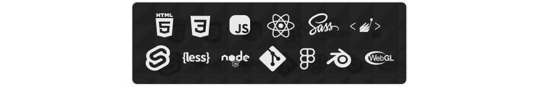

#


</br>

> _Hey there!_ As you know, my name is Alí. The most relevant thing about me is that I love learning, not only about programming but everything in the world! I'm also a Front-End Web Dev, UI/UX prototype design rookie and a _(upcoming)_ digital artist.

</br>

```javascript
const createSomething = async(day) => {
    try {
        const brainstorm = await fetch(`https://api.myideas.com/${day}/`);
        const letsDoIt = await brainstorm.json();
        const { chill_playlist, concept_idea } = letsDoIt;
        console.log(`Hey! I've got this awesome ${concept_idea}`);

    } catch (block) {
        console.log(`Easy! it's just a ${block}.`);
    }
};
createSomething('today');
```

</br>

**_Languages and tools_**

</br>

